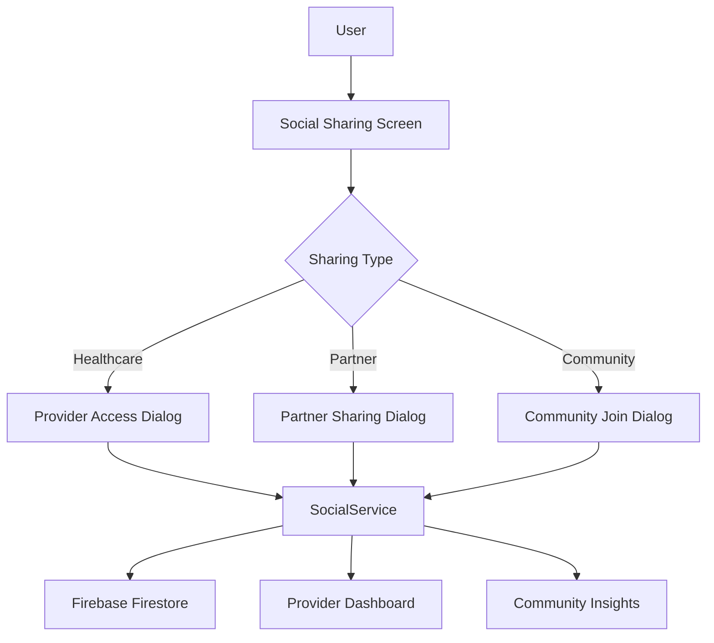

# 🌐 CycleSync Social Features Integration Guide

This comprehensive guide covers all the social sharing and community features implemented in CycleSync, including healthcare provider integration, partner sharing, and anonymous community research participation.

## 📋 Table of Contents

1. [Overview](#overview)
2. [Architecture](#architecture)
3. [Feature Breakdown](#feature-breakdown)
4. [Implementation Details](#implementation-details)
5. [Security & Privacy](#security--privacy)
6. [User Experience](#user-experience)
7. [Integration Steps](#integration-steps)
8. [Testing](#testing)
9. [Future Enhancements](#future-enhancements)

## 🎯 Overview

The social features in CycleSync enable secure, privacy-focused data sharing with healthcare providers and partners, while also supporting anonymous community research through aggregated insights.

### Key Features
- **Healthcare Provider Integration**: HIPAA-compliant secure sharing with medical professionals
- **Partner Sharing**: Simple, secure sharing with trusted partners
- **Community Research**: Anonymous participation in menstrual health research
- **Granular Privacy Controls**: User-controlled data permissions
- **Professional Dashboard**: Healthcare provider interface for data analysis

## 🏗️ Architecture

### Core Components

```
📁 lib/screens/social/
├── social_sharing_screen.dart          # Main social features interface
├── dialogs/
│   ├── share_data_dialog.dart          # Multi-step sharing wizard
│   ├── create_provider_access_dialog.dart # Healthcare provider access
│   ├── join_community_dialog.dart      # Community research onboarding
│   └── additional_dialogs.dart         # Partner sharing & preferences
└── provider/
    └── provider_dashboard.dart         # Healthcare provider dashboard

📁 lib/services/
├── social_service.dart                 # Core social functionality
└── models/
    └── social_models.dart              # Data models for social features
```

### Data Flow



## 🚀 Feature Breakdown

### 1. Healthcare Provider Sharing

**Purpose**: Secure, HIPAA-compliant data sharing with medical professionals

**Key Features**:
- Multi-step sharing wizard with clear privacy controls
- Granular data type selection (cycle patterns, symptoms, wellbeing, notes)
- Customizable access duration and expiration
- Secure token-based access
- Professional dashboard with clinical insights

**User Flow**:
1. User selects "Share with Healthcare Provider"
2. Enters provider information (name, email, type)
3. Configures permissions and data types
4. Sets access duration and options
5. Reviews and confirms sharing
6. Provider receives secure access link

### 2. Partner Sharing

**Purpose**: Simple, secure sharing with trusted partners for better support

**Key Features**:
- Streamlined sharing process
- Focus on cycle patterns and basic symptoms
- Optional personal messages
- Partner-friendly data presentation
- Easy revocation controls

**User Flow**:
1. User selects "Share with Partner"
2. Enters partner's email
3. Chooses what to share (patterns, symptoms, pain levels)
4. Sets sharing duration
5. Sends secure access link

### 3. Community Research Participation

**Purpose**: Anonymous contribution to menstrual health research

**Key Features**:
- Complete anonymization of data
- Tiered contribution levels (Minimal, Standard, Comprehensive)
- Optional demographic sharing (age range, geographic region)
- Community insights access
- Research ethics compliance

**User Flow**:
1. User chooses to join community research
2. Reviews benefits and research information
3. Selects contribution level and data types
4. Understands privacy and anonymization process
5. Provides consent for research participation
6. Gains access to community insights

### 4. Provider Dashboard

**Purpose**: Professional interface for healthcare providers to analyze patient data

**Key Features**:
- Patient information and access permissions
- Data summary and quick statistics
- Cycle pattern analysis with charts
- Symptom frequency tracking
- Clinical insights and recommendations
- Export capabilities (PDF, CSV)

**Dashboard Sections**:
- **Overview**: Patient info, data summary, quick stats
- **Patterns**: Cycle length trends, recent cycles, symptom charts
- **Analytics**: Clinical analytics, wellbeing trends, insights
- **Clinical**: Summary, recommendations, export options

## 🔧 Implementation Details

### Social Service (`social_service.dart`)

The `SocialService` class handles all social functionality:

```dart
class SocialService {
  // Share data with healthcare providers or partners
  static Future<ShareResult> shareWithProvider({
    required String providerEmail,
    required SharePermission permission,
    required DateRange dateRange,
    required List<DataType> dataTypes,
    String? personalMessage,
    Duration? expiration,
  });

  // Create long-term provider access
  static Future<ProviderAccessResult> createProviderAccess({
    required String providerName,
    required String providerEmail,
    required ProviderType providerType,
    required List<DataType> authorizedDataTypes,
    Duration? accessDuration,
  });

  // Join community research
  static Future<bool> joinCommunityDataSharing(
    CommunityDataPreferences preferences
  );

  // Get shared data for providers
  static Future<SharedDataResult> getSharedData(String shareToken);

  // Revoke access
  static Future<bool> revokeAccess(String shareId);
}
```

### Data Models (`social_models.dart`)

Key models for social features:

- `SharePermission`: View-only, full access, limited analytics
- `DataType`: Cycle patterns, symptoms, wellbeing, notes, analytics
- `ProviderType`: Gynecologist, GP, fertility specialist, etc.
- `ContributionLevel`: Minimal, standard, comprehensive
- `CommunityDataPreferences`: User's community sharing preferences

### Security Implementation

```dart
// Secure token generation
static Future<String> _createSecureShareToken() async {
  final timestamp = DateTime.now().millisecondsSinceEpoch;
  final random = (timestamp * 1000 + (DateTime.now().microsecond % 1000));
  return 'cs_${random.toRadixString(36)}_${timestamp.toRadixString(36)}';
}

// Data filtering based on permissions
static List<Map<String, dynamic>> _filterCycleData(
  List<Map<String, dynamic>> cycles,
  List<DataType> permittedTypes,
) {
  // Filter data based on user-granted permissions
}
```

## 🔒 Security & Privacy

### Data Protection

1. **End-to-End Encryption**: All shared data is encrypted in transit and at rest
2. **Secure Token Generation**: Cryptographically secure access tokens
3. **Permission-Based Filtering**: Data is filtered based on user permissions
4. **Audit Trails**: Complete logging of all access and sharing activities
5. **Automatic Expiration**: Time-limited access with automatic cleanup

### Privacy Controls

1. **Granular Permissions**: Users choose exactly what data to share
2. **Revocation Rights**: Users can instantly revoke access
3. **Anonymous Community Data**: Complete anonymization for research
4. **No Cross-Sharing**: Recipients cannot share data with others
5. **Privacy-by-Design**: Default settings favor user privacy

### HIPAA Compliance

- Secure authentication and authorization
- Encrypted data transmission
- Access logging and monitoring
- Patient consent management
- Provider identity verification

## 👤 User Experience

### Design Principles

1. **Transparency**: Clear information about what's being shared
2. **Control**: Users have complete control over their data
3. **Simplicity**: Complex privacy controls made simple
4. **Trust**: Building trust through clear privacy policies
5. **Empowerment**: Users understand the benefits of sharing

### User Interface Highlights

- **Step-by-step wizards** for complex sharing decisions
- **Visual permission controls** with clear explanations
- **Real-time preview** of what will be shared
- **Easy revocation** with confirmation dialogs
- **Progress indicators** for multi-step processes

## 🛠️ Integration Steps

### 1. Add to Navigation

```dart
// Add social sharing to main navigation
NavigationDestination(
  selectedIcon: Icon(Icons.people),
  icon: Icon(Icons.people_outline),
  label: 'Social',
),
```

### 2. Firebase Security Rules

```javascript
// Firestore security rules for shares collection
match /shares/{shareId} {
  allow read, write: if request.auth != null && 
    (request.auth.uid == resource.data.owner_id || 
     request.auth.uid == resource.data.provider_id);
}

match /community_participants/{userId} {
  allow read, write: if request.auth != null && 
    request.auth.uid == userId;
}
```

### 3. Provider Dashboard Setup

For healthcare providers accessing shared data:

```dart
// Provider dashboard route
GoRoute(
  path: '/provider/:shareToken',
  builder: (context, state) => ProviderDashboard(
    shareToken: state.pathParameters['shareToken']!,
  ),
),
```

### 4. Email Templates

Set up email templates for:
- Share notifications to providers/partners
- Welcome emails for new provider access
- Community research updates

## 🧪 Testing

### Unit Tests

```dart
// Test social service functionality
testWidgets('Share with provider creates secure access', (tester) async {
  final result = await SocialService.shareWithProvider(
    providerEmail: 'doctor@clinic.com',
    permission: SharePermission.fullAccess,
    dateRange: DateRange(start: DateTime.now().subtract(Duration(days: 90)), 
                         end: DateTime.now()),
    dataTypes: [DataType.cyclePattern, DataType.symptoms],
  );
  
  expect(result.success, isTrue);
  expect(result.shareToken, isNotNull);
});
```

### Integration Tests

- Test complete sharing workflows
- Verify permission enforcement
- Test provider dashboard functionality
- Validate community data anonymization

### Security Testing

- Token security validation
- Permission boundary testing
- Data leakage prevention
- Access revocation verification

## 🔮 Future Enhancements

### Planned Features

1. **AI-Powered Insights**: Enhanced analytics for providers
2. **Multi-Language Support**: Localized social features
3. **Advanced Analytics**: More detailed community insights
4. **Provider Network**: Directory of CycleSync-integrated providers
5. **Telemedicine Integration**: Direct consultation scheduling

### Potential Integrations

- Electronic Health Records (EHR) systems
- Telemedicine platforms
- Research institutions
- Health insurance providers
- Pharmacy networks

### Community Research Expansion

- Research study participation
- Clinical trial matching
- Population health insights
- Global menstrual health tracking

## 📞 Support & Maintenance

### Monitoring

- Share access analytics
- Community participation metrics
- Provider dashboard usage
- Security incident tracking

### Maintenance Tasks

- Token rotation and cleanup
- Expired share removal
- Community data aggregation
- Provider account management

### User Support

- Sharing troubleshooting guides
- Privacy concern resolution
- Provider onboarding support
- Community research explanations

---

## 🎉 Conclusion

The social features in CycleSync represent a comprehensive approach to secure, privacy-focused health data sharing. By implementing these features, users can:

- **Share securely** with healthcare providers for better care
- **Support partners** with appropriate cycle information
- **Contribute anonymously** to advancing menstrual health research
- **Maintain control** over their personal health data

The implementation prioritizes user privacy, data security, and ease of use while enabling meaningful connections that improve menstrual health outcomes.

For questions or support, please refer to the main documentation or contact the development team.
